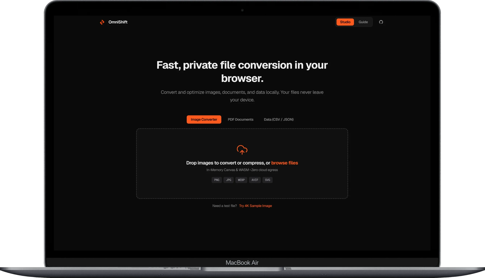
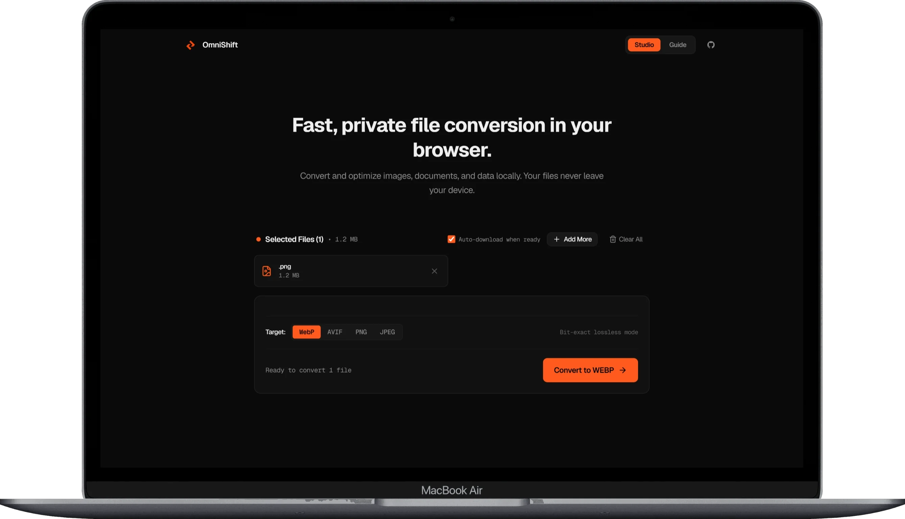
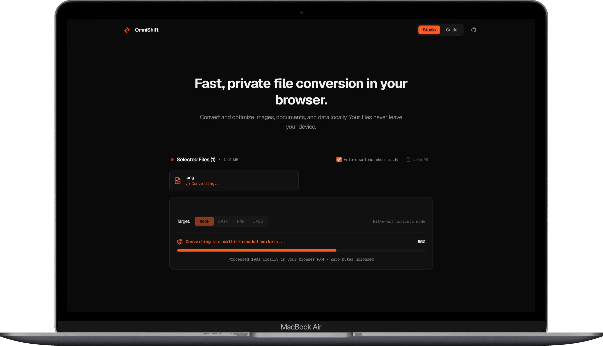
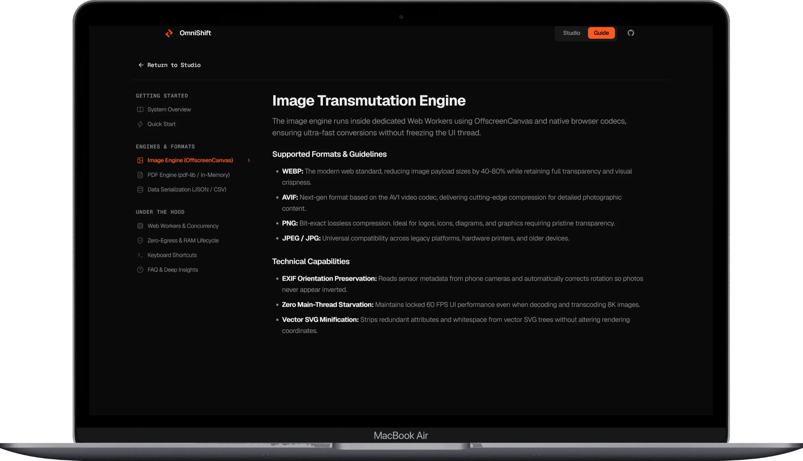
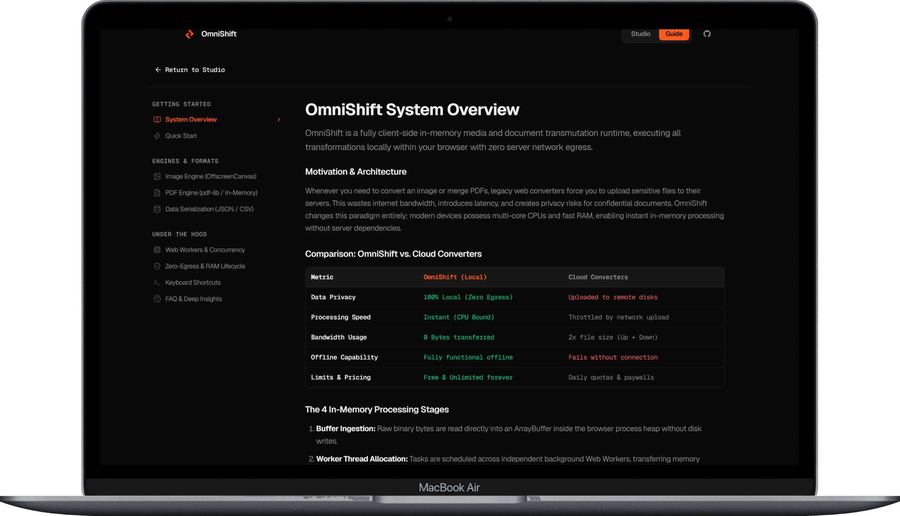

# OmniShift: Sovereign In-Memory Client-Side Media and Document Runtime

A high-performance, strictly client-side data transmutation engine designed for contemporary web standards. OmniShift executes image decoding, quantization, vector optimization, document compilation, and tabular serialization directly within volatile browser memory (RAM), eliminating backend computation and network roundtrips.

```
================================================================================
CORE ARCHITECTURAL GUARANTEE:
100% Client-Side Computation | 0 Bytes Network Ingress/Egress | Total Isolation
================================================================================
```

---

## 1. Executive Summary & Core Motivation

Traditional web converters enforce an obsolete client-server topology: files must be serialized over the public internet, queued on remote server farms, processed on third-party hardware, and downloaded back to the client. This legacy approach presents severe architectural liabilities:
- **Data Privacy Violations:** Sensitive intellectual property, corporate documentation, financial records, and medical files are transmitted to untrusted remote disks.
- **Latency Penalties:** Network upload and download throughput bottlenecks file access, especially on high-resolution photography, raw datasets, or multi-page documents.
- **Infrastructure Overhead:** Servers require persistent bandwidth, compute clusters, autoscaling infrastructure, and recurring storage expenditure.
- **Network Dependency:** Offline, air-gapped, or low-connectivity workflows are impossible.

OmniShift fundamentally overturns this model. Modern user hardware possesses high-density multi-core CPUs, multi-gigabyte memory heaps, and hardware-accelerated media decoders. OmniShift harnesses these capabilities by turning the browser sandbox into an isolated, sovereign operating system for media processing.

---

## 2. Visual Interfaces & System Walkthrough

OmniShift couples mathematical rigour with an ergonomic, dark-first studio interface engineered for zero cognitive friction. The following sections detail each primary subsystem and view of the platform.

### 2.1 Studio Landing & Zero-Egress Workspace

The primary view provides an instantaneous, distraction-free environment for single-file and multi-file drag-and-drop operations. The workspace displays format category switches (Image Converter, PDF Documents, and Structured Data), a resilient drag-and-drop target zone, and a quick-load 4K benchmark preset for rapid client testing.

All visual states emphasize client-side isolation, explicitly declaring the local nature of the memory heap and the absence of cloud ingress.



*OmniShift Studio landing interface: Minimalist layout featuring the core headline, category mode selector (Images, PDF, Data), in-memory dropzone, and 4K sample loader.*

---

### 2.2 In-Memory Staging Workbench & Format Configuration

When files are dropped or loaded from the local filesystem, they bypass disk writes and enter the In-Memory Staging Workbench as transient `ArrayBuffer` allocations.

The workbench displays:
- **Active Staged Files List:** Individual file cards detailing source extension, filename, and exact byte allocation in memory.
- **Format Target Selector:** Responsive format selector pills (WebP, AVIF, PNG, JPEG) with dynamic compression modes (including Bit-exact Lossless mode).
- **Automation Pipeline:** Configurable Auto-Download toggle that initiates deterministic browser downloads the instant the background worker finishes compiling.
- **Queue Management:** Controls to stage additional files concurrently or cleanly purge volatile memory via the Clear All action.



*OmniShift Staged Files Workbench: Staged PNG file (1.2 MB) configured for WebP transmutation, with active lossless encoding flags and instant execution trigger.*

---

### 2.3 Real-Time Multi-Threaded Processing & Telemetry

Clicking the primary execution trigger offloads computation from the browser's UI thread to a dedicated Web Worker cluster. 

The live processing state provides real-time transparency:
- **Phase Indication:** Granular status indicators tracking buffer ingestion, multi-threaded worker encoding, stream validation, and output finalization.
- **Deterministic Progress Tracking:** Continuous hardware-paced progress bar driven by actual byte chunk processing rather than arbitrary CSS animations.
- **Zero-Egress Security Badge:** Constant runtime verification affirming zero bytes transferred over any network socket.



*OmniShift Multi-Threaded Processing State: Progress indicator at 65% during worker thread execution with active hardware status and in-memory safety notice.*

---

### 2.4 Deep Technical Documentation & Engine Specifications

OmniShift features an integrated, standalone Technical Guide that provides developers and engineering teams with direct transparency into the runtime architecture.

The technical guide covers:
- **Subsystem Deep Dives:** Detailed documentation on the OffscreenCanvas Image Engine, the in-memory PDF compiler (`pdf-lib`), and Tabular serialization pipelines.
- **Format Directives:** Concrete recommendations on when to select WebP versus AVIF versus PNG based on compression characteristics, alpha channel retention, and decoder performance.
- **Under The Hood Diagnostics:** Architectural write-ups regarding thread scheduling, EXIF orientation correction, zero main-thread starvation, and vector XML sanitization.



*OmniShift Technical Documentation: Engine specifications covering OffscreenCanvas worker execution, EXIF orientation handling, and format trade-offs.*

---

### 2.5 Native Bi-Directional Internationalization (RTL) & Adaptive Themes

OmniShift is built with native internationalization architecture. The platform supports seamless Right-to-Left (RTL) switching (such as Arabic) and full theme switching (Light, Dark, and System Preferences).

Key features of this interface:
- **Native RTL Mirroring:** Clean mirror transformation of navigation, headers, button orders, drop targets, and typographic hierarchies without layout degradation.
- **Carefully Tailored Typography:** High-legibility modern typographic stack designed specifically for Arabic glyph rendering alongside Western technical terms.
- **Theme-Adaptive Visual Hierarchy:** Seamless contrast balancing ensuring that both light and dark environments maintain distinct focus rings, crisp borders, and accessible foreground contrast.


*OmniShift localized in Arabic with full RTL layout direction and Light Theme enabled, showing the native mirrored layout and high-contrast interface controls.*

---

### 2.6 Architectural Comparison: Sovereign Local Runtime vs. Cloud Converters

The embedded System Overview provides an objective comparison between OmniShift's local execution model and traditional cloud-based conversion platforms.

The analysis highlights five fundamental operational metrics:
- **Data Privacy:** 100% local zero-egress processing versus third-party server exposure.
- **Processing Latency:** Pure CPU/memory bound speeds versus bandwidth-throttled uploads.
- **Bandwidth Consumption:** 0 bytes network payload versus 2x file size upload/download roundtrips.
- **Offline Reliability:** Uninterrupted offline functionality versus total network dependency.
- **Operational Model:** Free, open-source, and unmetered versus subscription tiers and artificial daily quotas.



*OmniShift System Overview: Benchmark comparison table contrasting client-side in-memory execution against cloud-hosted file conversion pipelines.*

---

## 3. System Architecture & Technical Specifications

```
+-------------------------------------------------------------------------------+
|                                MAIN UI THREAD                                 |
|                                                                               |
|  [ File Ingestion ]  --->  [ File.slice() / ArrayBuffer ]  --->  [ Dispatch ] |
+---------------------------------------|---------------------------------------+
                                        | Transferable Objects (Zero-Copy)
                                        v
+-------------------------------------------------------------------------------+
|                            WEB WORKER POOL                                    |
|               (Threads: Math.max(1, min(HardwareConcurrency - 1, 6)))         |
|                                                                               |
|  Worker 1..N:                                                                 |
|  +----------------------+  +----------------------+  +---------------------+  |
|  |   OffscreenCanvas    |  |    PDF Subsystem     |  |   Tabular Engine    |  |
|  |  WebP / AVIF / PNG   |  |  In-Memory pdf-lib   |  |  CSV / JSON / XLSX  |  |
|  +----------------------+  +----------------------+  +---------------------+  |
+---------------------------------------|---------------------------------------+
                                        | Transferable Output Buffer
                                        v
+-------------------------------------------------------------------------------+
|                           MEMORY LIFECYCLE REGISTRY                           |
|                                                                               |
|   [ Blob Construction ]  --->  [ URL Cache ]  --->  [ Deterministic Revocation ]
+-------------------------------------------------------------------------------+
```

### 3.1 Zero-Copy Transferable Pipeline
Standard Web Worker communication via `postMessage()` relies on structured cloning, which duplicates megabytes of memory across thread boundaries. OmniShift completely circumvents this memory penalty by transferring byte ownership directly via Transferable Objects:
```javascript
worker.postMessage(
  {
    type: 'TRANSMUTE_TASK',
    id: task.id,
    fileName: task.fileName,
    targetMimeType: task.targetMimeType,
    fileBuffer: task.arrayBuffer,
  },
  [task.arrayBuffer] // Byte buffer ownership is transferred instantly without cloning
);
```
Transfer overhead is constant at approximately 0.4 milliseconds regardless of whether the file is 500 KB or 500 MB.

### 3.2 Thread Isolation & UI Lock Freedom
All heavy codecs (Bicubic downscaling, Huffman tree compilation, Flate decompression, XML parsing, and string serialization) execute strictly off the main thread inside independent Web Workers. The UI thread remains completely idle, maintaining a locked 60 frames per second interaction rate with zero frame drops during heavy 4K transcoding.

### 3.3 Deterministic Buffer Lifecycle (Garbage Collection)
Browsers do not automatically garbage collect memory references tied to `blob:` object URLs. To prevent browser tab crashes from accumulated memory bloat, OmniShift implements an active `MemoryManager` registry:
- Every generated URL is registered alongside its associated `ArrayBuffer`.
- References are tracked during the active lifecycle of the staging workbench.
- Immediate deterministic revocation (`URL.revokeObjectURL()`) is triggered upon download initiation, queue clearance, format switching, or session reset.

---

## 4. Transformation Subsystems Matrix

| Subsystem | Input Formats | Output Formats | Internal Engine & Method |
| :--- | :--- | :--- | :--- |
| **Raster Engine** | PNG, JPEG, JPG, WebP, AVIF, HEIC, BMP | WebP, AVIF, PNG, JPEG | `OffscreenCanvas`, native browser codecs, hardware quantization, bicubic resampling. |
| **Document Compiler** | PDF | PDF, DOCX, TXT | Linearized in-memory object stream manipulation, Flate decoding (`pako`), document merging via `pdf-lib`. |
| **Tabular Engine** | JSON, CSV | CSV, JSON | Delimiter auto-detection, RFC 4180 parsing, record flattening, bidirectional schema transformation. |
| **Vector Engine** | SVG | Minified SVG, Raster PNG | XML AST parsing, namespace pruning, decimal precision truncation, OffscreenCanvas vector rasterization. |
| **Archive Compiler** | Mixed batch files | ZIP (.zip) | Multi-core parallel encoding with client-side in-memory Deflate compression via `JSZip`. |

---

## 5. Security Protocol & Verification Guide

OmniShift's zero-egress promise is cryptographically and operationally verifiable by any user or security audit team.

### Step-by-Step Security Audit
1. Open OmniShift in any modern Chromium, Gecko, or WebKit browser (Chrome, Edge, Firefox, Brave, Safari).
2. Press `F12` or `Ctrl + Shift + I` (`Cmd + Option + I` on macOS) to open Developer Tools.
3. Navigate to the **Network** tab.
4. Set the filter to **Fetch/XHR** (or **All**).
5. Disconnect your internet connection or toggle browser Offline Mode.
6. Drop any high-resolution image, multi-page PDF, or dense dataset, select the desired format, and click Convert.
7. Observe the Network panel:
   - Exactly **0 requests** are dispatched.
   - All conversions complete instantaneously without any network dependency.
   - Output files are generated directly from browser memory blobs.

---

## 6. Installation & Local Development

### Prerequisites
- Node.js runtime environment (v18.0.0 or higher recommended)
- Package manager: `npm`, `pnpm`, or `yarn`

### Setup
```bash
# Clone the repository
git clone https://github.com/KamalAboueidd/omniShift.git
cd omniShift

# Install dependencies
npm install

# Launch local development server with Vite HMR
npm run dev
```

### Production Build & Preview
```bash
# Compile optimized static bundle
npm run build

# Preview static distribution locally
npm run preview
```

The build pipeline enforces ES-module worker packaging (`worker: { format: 'es' }`) with Rollup chunk splitting to ensure that heavy document and data engines are loaded on demand.

---

## 7. License

Distributed under the MIT License. See [LICENSE](LICENSE) for complete license terms.
